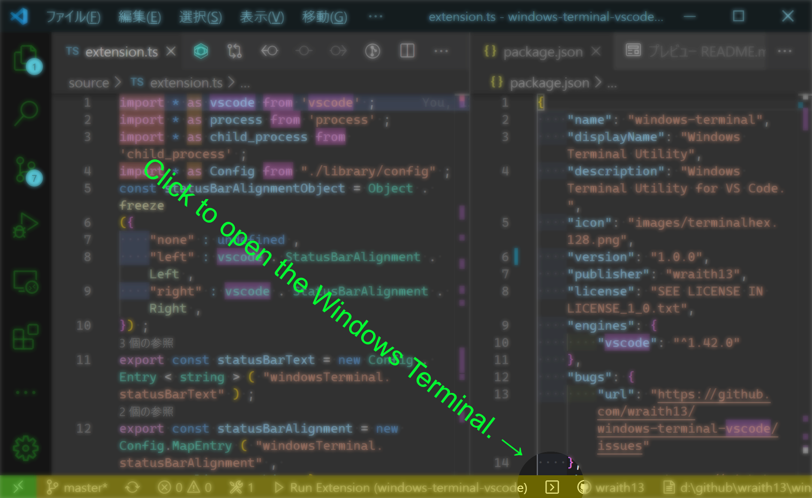

# Windows Terminal Utility README

Windows Terminal Utility for VS Code. ( ⚠ This is a unofficial extension. )

## ⚠ Requirements

- [Windows Terminal](https://www.microsoft.com/ja-jp/p/windows-terminal-preview/9n0dx20hk701)

## Features

- Open Windows Terminal from Command Palette
- Open Windows Terminal from Status bar
- Open Windows Terminal' `settings.json`
- otheres.

## Tutorial

### 0. ⬇️ Install Windows Terminal

Install Windows Terminal from here: <https://www.microsoft.com/ja-jp/p/windows-terminal-preview/9n0dx20hk701>

### 1. ⬇️ Install Windows Terminal Utility

Show extension side bar within VS Code(Mac:<kbd>Command</kbd>+<kbd>Shift</kbd>+<kbd>X</kbd>, Windows and Linux: <kbd>Ctrl</kbd>+<kbd>Shift</kbd>+<kbd>X</kbd>), type `windows-terminal` and press <kbd>Enter</kbd> and click <kbd>Install</kbd>. Restart VS Code when installation is completed.

### 2. 🚀 Open Windows Terminal

Launch Command Palette(Mac:<kbd>F1</kbd> or <kbd>Shift</kbd>+<kbd>Command</kbd>+<kbd>P</kbd>, Windows and Linux: <kbd>F1</kbd> or <kbd>Shift</kbd>+<kbd>Ctrl</kbd>+<kbd>P</kbd>), Execute `Windows Terminal: Open` or `Windows Terminal: Open with Profile ...` command. You can open Windows Terminal.

### 2. 🔧 Next step

You can change [settings](#extension-settings) by `settings.json`. And you can apply [keyboard shortcuts](#keyboard-shortcut-settings) by `keybindings.json`.

Enjoy!

## Commands

* `Windows Terminal: Open` : Open Windows Terminal.
* `Windows Terminal: Open with Profile ...` : Select a profile and open Windows Terminal.
* `Windows Terminal: Open settings.json` : Open Windows Terminal's settings.json.
* `Windows Terminal: Show Store` : Show Windows Terminal in Microsoft Store.
* `Windows Terminal: Show User Document` : Show Windows Terminal's user document.

## Extension Settings

This extension contributes the following settings by [`settings.json`](https://code.visualstudio.com/docs/customization/userandworkspace#_creating-user-and-workspace-settings)( Mac: <kbd>Command</kbd>+<kbd>,</kbd>, Windows / Linux: <kbd>File</kbd> -> <kbd>Preferences</kbd> -> <kbd>User Settings</kbd> ):

* `windowsTerminal.settingsJsonPath`: Path of Windows Terminal's settings.json.
* `windowsTerminal.defaultProfile`: GUID of default profile.
* `windowsTerminal.enabledDirectoryOption`: Enabled directory option.
* `windowsTerminal.defaultDirectory`: Default directory. ( If not specified, it will open a workspace folder. )
* `windowsTerminal.defaultOptions`: Other options for Windows Terminal.
* `windowsTerminal.statusBarAlignment`: Alignment on status bar. Requires a restart to take effect.
* `windowsTerminal.statusBarText`: Status bar's label.
* `windowsTerminal.statusBarCommand`: Status bar's command.

## Keyboard shortcut Settings

In default, filePathBar's commands doesn't apply keyboard shortcuts. Althogh,
you can apply keyboard shortcuts by [`keybindings.json`](https://code.visualstudio.com/docs/customization/keybindings#_customizing-shortcuts)
( Mac: <kbd>Code</kbd> -> <kbd>Preferences</kbd> -> <kbd>Keyboard Shortcuts</kbd>, Windows / Linux: <kbd>File</kbd> -> <kbd>Preferences</kbd> -> <kbd>Keyboard Shortcuts</kbd>).

Command name on `keybindings.json` is diffarent from on Command Pallete. See below table.

|on Command Pallete|on keybindings.json|
|-|-|
|`Windows Terminal: Open`|`windowsTerminal.open`|
|`Windows Terminal: Open with Profile ...`|`windowsTerminal.openProfile`|
|`Windows Terminal: Open settings.json`|`windowsTerminal.openSettings`|
|`Windows Terminal: Show Store`|`showStore`|
|`Windows Terminal: Show User Document`|`windowsTerminal.showDocument`|

## Release Notes

see ChangLog on [marketplace](https://marketplace.visualstudio.com/items/wraith13.windows-terminal/changelog) or [github](https://github.com/wraith13/file-path-bar-vscode/blob/master/CHANGELOG.md)

## Support

[GitHub Issues](https://github.com/wraith13/windows-terminal-vscode/issues)

## License

[Boost Software License](https://github.com/wraith13/windows-terminal-vscode/blob/master/LICENSE_1_0.txt)

## Other extensions of wraith13's work

|Icon|Name|Description|
|---|---|---|
| |[Background Phi Colors](https://marketplace.visualstudio.com/items?itemName=wraith13.background-phi-colors)|This extension colors the background in various ways.|
| |[Zoom Bar](https://marketplace.visualstudio.com/items?itemName=wraith13.zoombar-vscode)|Zoom UI in status bar for VS Code.|
| |[Unsaved Files](https://marketplace.visualstudio.com/items?itemName=wraith13.unsaved-files-vscode)|Easy access to unsaved files for VS Code.|

See all wraith13's  expansions: <https://marketplace.visualstudio.com/publishers/wraith13>
